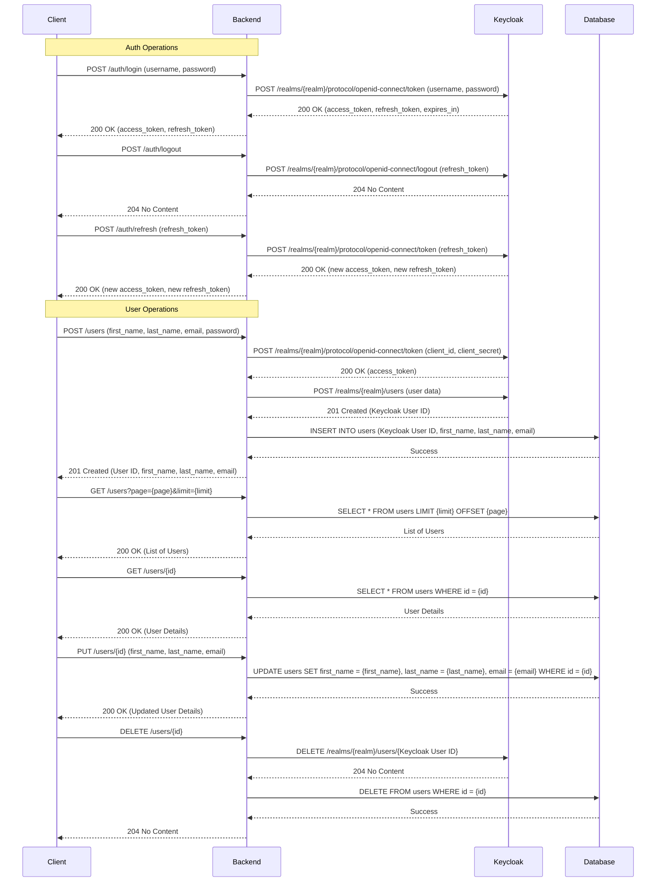

VoiceLine exercise.
====

1) _If you would build VoiceLine from scratch, which tech would you use, what would be building blocks and how would communication between those blocks look like?_

The VoiceLine application can be built using the following technologies:


Main system blocks:
- **Frontend** - The user interface that interacts with the user (Mobile, Desktop, Web etc).
    
  - Technologies: React or Flutter.
  - Communication: REST API, Websockets.

- **Integration/Processing** - The server-side service that processes requests and integrations.

    - Technologies: Golang, Python, Node.js.
    - Communication: REST API, Websockets, Protobuf.
  
- **Storage** - A storage system for storing data (databases).
    
    - Technologies: PostgreSQL, MongoDB.
    - Communication: SQL, NoSQL. 

- **Voice Processing** - A service for processing voice data.
    
    - Technologies: Python, Golang.
    - Communication: REST API, Protobuf, Async messages (Kafka).

- **AI/ML Analytics** - A service for analyzing voice data.
    
    - Technologies: Python, Golang.
    - Communication: REST API, Protobuf, Async messages (Kafka).

- **External Services** - External services for integration (CRM, ERP etc).

    - Communication: REST API, Protobuf.

Additional blocks can be added:

- **Monitoring** - Monitoring system for tracking system performance and errors.

    - Technologies: Prometheus, Grafana, Jaeger.
    - Communication: HTTP, gRPC. 

- **CI/CD** - Continuous integration and deployment for services.

    - Technologies: Jenkins, GitLab CI/CD.
    - Communication: HTTP, gRPC.
    
---

2) _Quickly set up a Backend in Golang with a backend framework of your choice and register a user - with a script or a function call or frontend input - with a authentication provider, please try to do a http request to their REST api of said provider. Spin up a lightweight DB of your choice and save user information to it. Dont overengineer it, stop at a maximum of 4 hours invested!_


## Plan application

Create a Golang application with the following parts:

1) REST API for user management (users).
2) Authentication and authorization using JWT via Keycloak (keycloak).
3) All data will be stored in a PostgreSQL database.
4) The application will be run in Docker containers.

Application starts with a contract description in the OpenAPI-format `doc/swagger.yaml`.
After code generation, the implementation code is written in the file `api/impl.go` and the corresponding tests.

## Schema



## Build application

Build and check code can be done with the `make` command via Makefile.


## Run application as CLI application

```shell
export VOICELINE_CONFIG_PATH=config/local.yaml
```

```shell
go run  ./cmd/users/main.go
```

## Run application as docker containers

```shell
docker compose up -d
```

## Stop application with docker containers

```shell
docker compose down
```

## Documentation of API (swagger)

See swagger documentation file [here](swagger/swagger.yaml)

Swagger file can be used for API testing.


## Run tests

```shell
make test
```

## Test coverage


To update test coverage, run:

```shell
make update-readme
```

## Implementation

1) The implementation starts with a contract description in the OpenAPI-format
`doc/swagger.yaml`. 
2) According to the contract description, the code for the server is generated:
```shell
make gen
```
3) Next, we need to implement the implementation code in the file `api/impl.go` and the corresponding tests.
4) Generation of mocks for the test is performed by the command
```shell
make mocks
```
5) Testing can be performed using a contract file `doc/swagger.yaml` or a utility program like `Postman`.

## Authentication and Authorization

An application uses JWT for authentication and authorization. 
The JWT token will be generated when the user logs in and will be used for subsequent requests. 
The token will be stored in the `Authorization` header.

We use a third-party system [KeyCloak](https://www.keycloak.org/)


Admin panel:
http://localhost:8403/

```
KEYCLOAK_USER: admin
KEYCLOAK_PASSWORD: admin
```

### Getting client secret

Client: admin

URL: http://localhost:8087/

Your client need to have the access-type set to `confidential` , then you will have a new tab credentials where you will see the `client secret`.

See https://wjw465150.gitbooks.io/keycloak-documentation/content/server_admin/topics/clients/oidc/confidential.html

Client secret is needed to put in parameter

```keycloak->client_secret:```

in files
- .\config\local.yml
- .\config\prod.yml
